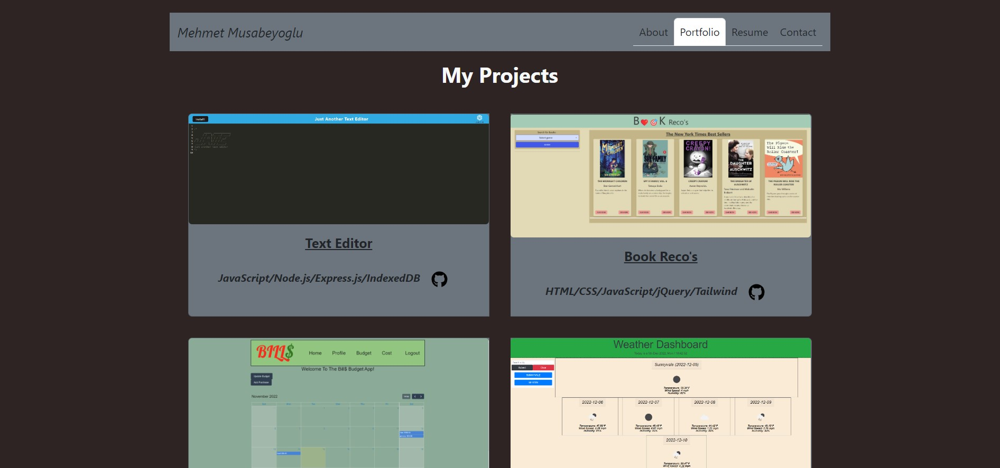

# React Portfolio


## Table of Contents

* [Description](#description)
* [Deployed Link](#deployed-link)
* [User Story](#user-story)
* [Screenshots](#screenshots)
* [Code Snippets](#code-snippets)
* [Technologies Used](#technologies-used)
* [Credits](#credits)
* [Author Links](#author-links)
* [License](#license)


## Description

This is my professional portfolio page created using the React.js framework as a single page web application. Specificially, this portfolio application uses the React-Bootstrap and React-Icon packages of React.js. 


## Deployed Link

Deployed link is [here](https://mehmetmusabeyoglu.github.io/React-Portfolio/)


## User Story

| As a        | I want to                                                            | So that   
| ----------- | -------------------------------------------------------------------- | -------------------------------------------- |
| `employer looking for candidates with experience building single-page applications` | view a potential employee's deployed React portfolio of work samples | `I can assess whether they're a good candidate for an open position` |


## Screenshots

### *Homepage*


### *Portfolio page*




## Code Snippets

### Main Function:
#### For rendering the selected page.

```

export default function Main() {
  const [currentPage, setCurrentPage] = useState("AboutMe");

  const renderPage = () => {
    if (currentPage === "AboutMe") {
      return <AboutMe />;
    }
    if (currentPage === "Portfolio") {
      return <Portfolio />;
    }
    if (currentPage === "Resume") {
      return <Resume />;
    }
    if (currentPage === "Contact") {
      return <Contact />;
    }
  };

  const handlePageChange = (page) => setCurrentPage(page);

  return (
    <div>
      <header>
        <NavBar currentPage={currentPage} handlePageChange={handlePageChange} />
      </header>
      <main>
        {renderPage()}
        <Footer />
      </main>
    </div>
  );
}

```

### NavBar Function:
#### For navigation bar functionality.

```

function NavBar({ currentPage, handlePageChange }) {
    return (
        <div>
            <Navbar bg="secondary" expand="lg">
                <Container>
                    <Navbar.Brand className="text-dark"><em>Mehmet Musabeyoglu</em></Navbar.Brand>
                    <Nav justify variant="tabs" defaultActiveKey={"AboutMe"} onSelect={(item) => handlePageChange(item)}>
                        <Nav.Item>
                            <Nav.Link className="text-dark" eventKey={"AboutMe"}>About</Nav.Link>
                        </Nav.Item>
                        <Nav.Item>
                            <Nav.Link className="text-dark" eventKey={"Portfolio"}>Portfolio</Nav.Link>
                        </Nav.Item>
                        <Nav.Item>
                            <Nav.Link className="text-dark" eventKey={"Resume"}>Resume</Nav.Link>
                        </Nav.Item>
                        <Nav.Item>
                            <Nav.Link className="text-dark" eventKey={"Contact"}>Contact</Nav.Link>
                        </Nav.Item>
                    </Nav>
                </Container>
            </Navbar>

        </div>
    );
}

```


## Technologies Used

- JavaScript
- Node.js
- React
- React-Bootstrap
- React-Icon
- Gitbash
- GitHub   
- GitHub Pages


## Credits

[React](https://reactjs.org/)

[React-Bootstrap](https://react-bootstrap.github.io/getting-started/introduction/)

[React-Icon](https://react-icons.github.io/react-icons/)


## Author Links

[LinkedIn Profile](https://www.linkedin.com/in/mehmet-musabeyoglu)

[GitHub Profile](https://github.com/MehmetMusabeyoglu)

[E-mail Address](mailto:mehmetmusabeyoglu@gmail.com) 

[Medium Profile](https://medium.com/@mehmetmusabeyoglu) 


## License 

 This project is licensed under the MIT License 
 <br>
 [](https://opensource.org/licenses/MIT)


